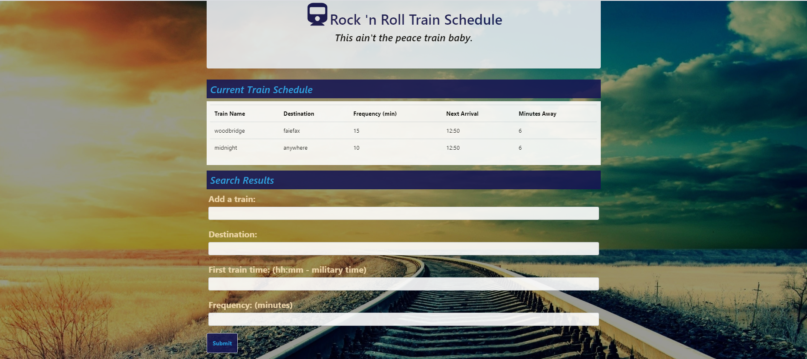

<h4>Train Schedule:</h4>
<h5>Shopping made easy</h5>
This project is a train schedule application that incorporates Firebase to host arrival and departure data. The app includes a form where users can enter information about a train, such as name, destination, first train time, and frequency. After a user submits the form, the app retrieves and manipulates this information with Moment.js to calculate the estimated next train time and number of minutes away. Moment.js is also used to display the times in a user friendly format (that is, hh:mm). When a user submits the information for a train, the train informaton is added to the Current schedule table to provide up-to-date information about various trains, such as their arrival times and how many minutes remain until they arrive at their stations. Not only is the train information added to the table, but the data is also pushed to a database that is hosted on Firebase. Source code will be developed over time to handle new features in the future.

<h4>Link to portfolio:</h4>
<h5>Repository:</h5><a href="https://nargesfayazian.github.io/Train-Schedule/">https://nargesfayazian.github.io/train-Schedule/</a>

<h4>How to work:</h4>
When adding trains, administrators are able to submit the following:
1.Train Name
2.Destination
3.First Train Time -- in military time
4.Frequency -- in minutes
App uses data validation for user inputted trains. then calculates when the next train will arrive relative to the current time and train info is stored using FireBase. 

  <h4>Tools/Languages Used:</h4>
    <ol>Firebase</ol>
    <ol>HTML</ol>
    <ol>CSS</ol>
    <ol>Bootstrap</ol>
    <ol>Javascript</ol>
     <ol>Moment.js</ol>
     <ol>jQuery</ol>
 